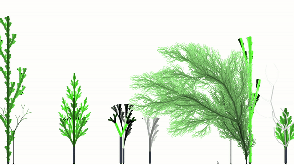
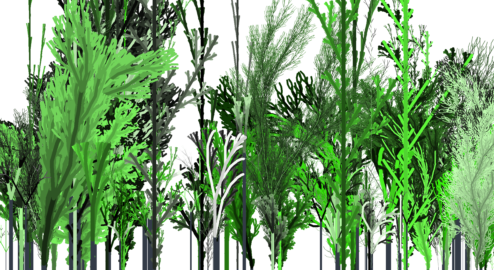
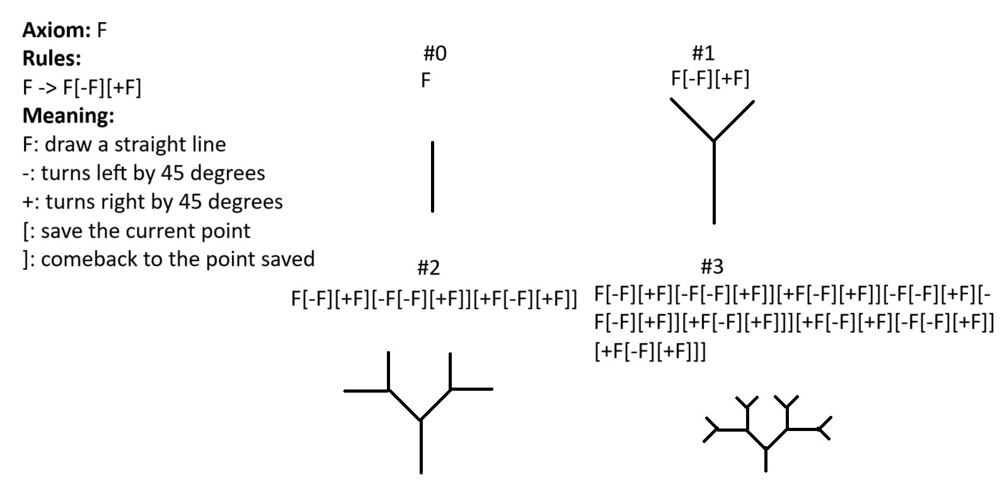

# L-systems






This project aims to implement the creation of fractal trees using L-systems

L-systems was first developed by a biologist named Lindenmayor. The systems was used to study the development of simple multicellular organisms, then subsequently apply to create plant organs.

### How does it work?
L-systems involves defining a string of symbols, the meaning for each symbols, and rules, then keep applying this rules for a number of iterations. 



### Directory structure
```
├── $ROOT
│   ├── plants.py
│   └── drawer.py
```

`plants.py` is where all classes of trees are declared. Each class associates with different kind of tree with different rules.

`drawer.py` is where the drawing logic happens. This project supports the following characters
<ul>
  <li>F: draw a straight line</li>
  <li>G: draw a straight line</li>
  <li>B: draw a straight line</li>
  <li>+: turn right by `theta` degrees, where `theta` is the amount of angle</li>
  <li>-: turn right by `theta` degrees, where `theta` is the amount of angle</li>
  <li>[: save the current position</li>
  <li>]: pop back the latest saved position</li>
</ul>

### Randomness
To make it more interesting, I added simple randomness to some rules in some kind of trees, this will make the generated fractal trees better resemble the real tree since it is not uniform and slightly different in each generation. 

### Setup
This project required `numpy` and `turtle` to function, please install them using your prefer package manager.
 then
```zsh
python drawer.py
```
the current code is running a function called `make_forest()` which randomly generated 100 trees.

### Source
Most of the ideas in this project are derived from the first chapter of 
[this book](http://algorithmicbotany.org/papers/abop/abop.pdf)

### Youtube Video
[Video Presentation](https://youtu.be/3wgcUKd4k04?si=Jwy67OuachwqPLRr)
